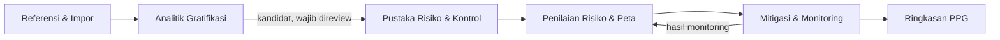

# Plan

Membangun modul baru **Khusus PPG (Program Pengendalian Gratifikasi)** sebagai satu alur kerja terpadu, bukan menyalin 19 sheet Excel menjadi 19 halaman. Modul akan menghubungkan data laporan gratifikasi, analitik, pustaka risiko, penilaian, pengendalian, dan monitoring dengan aturan PPG yang terpisah dari mesin risiko umum dan SMAP.

## Scope

- In:
  - Menambahkan satu menu tingkat atas `Khusus PPG` pada dashboard dan submenu internal PPG yang konsisten pada desktop maupun mobile.
  - Membuat konteks PPG berbasis unit kerja, tahun, dan periode/triwulan.
  - Memigrasikan bagian workbook yang valid sebagai data awal dengan jejak asal data, preview, validasi, deduplikasi, dan audit impor.
  - Menyediakan pustaka risiko dan kontrol, risk register PPG, peta risiko, mitigasi/monitoring, serta analitik laporan gratifikasi.
  - Membatasi akses menurut peran dan unit kerja serta melindungi data pribadi pada laporan gratifikasi.
  - Memakai pola Next.js 16 App Router, Server Components, Server Actions tipis, Supabase, dan komponen UI yang sudah ada.
- Out:
  - Implementasi kode, eksekusi migrasi database, perubahan workbook sumber, dan impor ke lingkungan produksi pada tahap planning ini.
  - Integrasi langsung dengan API KPK, SMAP eksternal, Google Drive, atau tautan bukti pada workbook sebelum format dan otorisasinya disepakati.
  - Menjadikan hasil inferensi kata kunci sebagai fakta atau otomatis mempromosikannya menjadi risiko aktif tanpa review manusia.

**Dasar analisis workbook**

- Workbook berisi 19 sheet: 17 terlihat dan 2 tersembunyi (`Sheet1`, `data`). Strukturnya membentuk dua domain utama:
  1. pengelolaan risiko gratifikasi: pustaka risiko, risk register, penilaian, kontrol, dan mitigasi;
  2. analitik laporan gratifikasi: data GOL, kamus klasifikasi, agregasi, temuan, dan lima grafik.
- Dependensi formula utama hanya membentuk tiga rantai yang jelas: `Worksheet (GOL) → Kamus → Analisis Gratifikasi`, `Risk Register 2026 → Matriks Risiko UPG KPK 5x5`, dan formula internal pada pustaka/register. Karena itu, sheet kontributor dan lookup tidak layak menjadi submenu tersendiri.
- `Worksheet (GOL)` memuat 1.079 laporan, termasuk nama penerima, NIK, satker, nama pemberi, tanggal, objek, nilai, dan status. Dashboard workbook menghitung total nilai Rp393.457.244, 125 laporan berobjek uang, tingkat penolakan 12,9%, serta konsentrasi tertinggi pada Ketua Pengadilan dan Hakim.
- Kualitas data belum seragam: 59 laporan tidak memiliki tanggal dan uraian objek; 549 tidak memiliki nilai penetapan dan status penetapan; 829 tidak memiliki nomor SK; serta 105 tidak memiliki unit kerja. Data mentah harus dipisahkan dari tampilan agregat dan NIK wajib dimasking/dibatasi.
- Insight yang dapat menjadi *kandidat* pustaka risiko antara lain musim Ramadan/Idulfitri, objek uang/setara uang, kerja sama perbankan, koordinasi antarinstansi, relasi vendor/pengadaan, dan kegiatan pendidikan/PKL. Kandidat tetap harus disetujui pengelola PPG sebelum masuk pustaka atau register.
- Ada konflik aturan yang harus diselesaikan sebelum coding:
  - matriks umum MA memakai skor ordinal non-perkalian dari `RISK_MATRIX` aplikasi;
  - SMAP memakai `K × D` tetapi ambangnya 1–2, 3–4, 5–9, 10–14, 15–25;
  - PPG pada register/UPG memakai `K × D` dengan ambang 1–5, 6–11, 12–15, 16–19, 20–25;
  - `Master Pustaka Risiko` memakai ambang 1–5, 6–10, 11–15, 16–19, 20–25.
- Workbook juga memiliki cacat referensi: dua formula `#REF!` pada matriks UPG, satu defined name `id_level_risiko` yang mengarah ke `#REF!`, dan 26 hasil error pada `Risk Register 2026` akibat lookup/mapping yang tidak lengkap. Nilai tersebut tidak boleh diimpor sebagai kebenaran tanpa rekalkulasi dan validasi.

**Arsitektur submenu yang direkomendasikan**

| Submenu | Route rencana | Cakupan terintegrasi | Sumber workbook |
|---|---|---|---|
| Ringkasan PPG | `/dashboard/ppg` | pemilih konteks unit/tahun/triwulan, KPI, risiko prioritas, progres mitigasi, alert kualitas data, dan shortcut alur | ringkasan register dan `Analisis Gratifikasi` |
| Pustaka Risiko & Kontrol | `/dashboard/ppg/pustaka` | proses bisnis, kategori/klasifikasi, pernyataan risiko penyebab–peristiwa–dampak, katalog kontrol, versi, status draft/review/aktif, dan contoh kontekstual | `Panduan Penggunaan`, `Proses Bisnis`, `Master Pustaka Risiko`, `Kategori Risiko`, `Control Library`, `Contoh Pengisian` |
| Penilaian Risiko & Peta | `/dashboard/ppg/penilaian` | risk register per konteks, probabilitas, dampak, faktor penyebab, skor/level PPG, sumber/bukti, peta 5×5, filter satker/sektor, dan prioritas | `Risk Register 2026`, `RR IANA`, `RR CC`, `RR Idha`, `RR Dml`, `Matriks Risiko UPG KPK 5x5` |
| Mitigasi & Monitoring | `/dashboard/ppg/tindak-lanjut` | pengendalian saat ini, penilaian efektivitas, rencana perbaikan, PIC, tenggat, status, bukti, dan pergeseran risiko sebelum–sesudah | kolom M:P register dan `Control Library` |
| Analitik Gratifikasi | `/dashboard/ppg/analitik` | tren jabatan, objek, skenario, musim, tipe pemberi, kegiatan/momen, nilai, penolakan, kualitas data, serta pembuatan kandidat risiko untuk direview | `Worksheet (GOL)`, `Analisis Gratifikasi`, lima grafik |
| Referensi & Impor | `/dashboard/ppg/referensi` | kriteria kemungkinan/dampak, versi matriks dan ambang, klasifikasi sektor/faktor, kamus kata kunci, impor risk register/GOL, pemetaan kolom, preview error, dan riwayat impor; khusus pengelola/admin | `Kriteria Penilaian`, kedua matriks, hidden `data`, `Kamus`, seluruh sheet `RR *` |

`RR IANA`, `RR CC`, `RR Idha`, dan `RR Dml` diperlakukan sebagai sumber/staging dengan provenance, bukan empat submenu. `Sheet1` hanya berisi catatan konseptual manajemen risiko sehingga menjadi bahan dokumentasi internal, bukan data aplikasi. Hidden `data`, `Kamus`, kriteria, dan matriks menjadi referensi terkelola di balik UI.

**Keputusan arsitektur awal**

- Tampilkan satu item global `Khusus PPG` di `src/app/dashboard/Sidebar.tsx`; submenu diletakkan dalam shell modul `src/app/dashboard/ppg/layout.tsx` melalui `PpgModuleNav`, sehingga sidebar global tidak semakin padat dan navigasi mobile tetap terkendali.
- Gunakan `Link` untuk navigasi dan pertahankan Server Components sebagai default. Jika konteks tetap dibawa melalui `?konteks=`, validasi UUID, akses unit, dan kepemilikan di server pada setiap halaman dan mutasi.
- Buat mesin domain PPG sendiri di `src/lib/ppg/` dan jangan memanggil `smapRiskLevel` atau `risk-engine` untuk menentukan level PPG. Visual matriks boleh berbagi primitive tampilan setelah logika skor dipisahkan dari renderer.
- Gunakan Data Access Layer `server-only` untuk query PPG dan DTO minimal untuk Client Components. `src/proxy.ts` hanya boleh menjadi pemeriksaan optimistis; otorisasi final harus ada pada DAL/Server Action dan Supabase RLS.
- Gunakan tabel terpisah, minimal: konteks/periode, peran PPG, pustaka risiko, katalog kontrol, relasi risiko–kontrol, register/penilaian, tindakan mitigasi, laporan gratifikasi, batch impor, kamus/aturan klasifikasi, serta audit perubahan. Master bersama seperti `unit_kerja` tetap direferensikan, bukan diduplikasi.
- Simpan hasil klasifikasi sebagai `label`, `rule_version`, `confidence/source`, dan `review_status`. Bedakan label eksplisit, dugaan berbasis kata kunci, dan data tidak memadai.
- Jadikan workbook sebagai sumber seed dan bukti asal, bukan mesin kalkulasi produksi. Semua skor dihitung ulang oleh domain service dari input atomik dan versi kriteria yang aktif.

## Action items

[ ] Tetapkan spesifikasi domain PPG sebelum coding: sahkan ambang skor PPG, daftar sektor/faktor penyebab, periode pelaporan, status workflow, aturan persetujuan kandidat risiko, serta matriks peran `admin_ppg/pengelola/verifikator/pimpinan` terhadap unit kerja; dokumentasikan keputusan di `PPG/` dan jadikan versi kriteria eksplisit.

[ ] Rancang migrasi `supabase/migration_ppg.sql` untuk entitas konteks, peran, pustaka, kontrol, register, mitigasi, laporan, kamus, batch impor, dan audit; tambahkan unique key bisnis, foreign key, status/versi, timestamp, soft-retirement untuk master yang pernah dipakai, serta RLS berbasis `auth.uid()`, peran PPG, dan scope unit kerja.

[ ] Tambahkan lapisan domain dan akses data di `src/lib/ppg/` (`scoring.ts`, `types.ts`, `validation.ts`, `access.ts`, `data.ts`): implementasikan skor `K × D`, ambang versi PPG, validasi transisi status, DTO tanpa NIK/nama pemberi untuk analitik umum, dan pemeriksaan otorisasi per resource; buat Server Actions di route PPG hanya sebagai adapter tipis yang mengautentikasi, memvalidasi input, memanggil DAL, lalu merevalidasi path.

[ ] Bangun shell modul di `src/app/dashboard/ppg/layout.tsx`, `PpgModuleNav.tsx`, dan `page.tsx`; tambahkan satu item `Khusus PPG` di `src/app/dashboard/Sidebar.tsx` dan flag `bisaAksesPpg` dari `src/app/dashboard/layout.tsx`; sembunyikan submenu yang tidak diizinkan tanpa mengandalkan penyembunyian UI sebagai kontrol keamanan.

[ ] Implementasikan `pustaka` sebagai satu workspace bertab untuk proses bisnis, pustaka risiko, kategori, dan kontrol; sediakan pencarian/filter, detail penyebab–dampak, versioning, review/approval, relasi banyak-ke-banyak risiko–kontrol, serta tombol “buat draf register dari pustaka” agar komponen terkait tetap satu kesatuan.

[ ] Implementasikan `penilaian` sebagai register per konteks yang menghitung ulang probabilitas, dampak, skor, level, dan peta 5×5 dari mesin PPG; tampilkan provenance impor dan warning data tidak lengkap; buat matriks PPG terpisah atau refactor renderer matriks agar visual dapat dipakai ulang tanpa membawa aturan skor MA/SMAP yang berbeda.

[ ] Implementasikan `tindak-lanjut` dengan baseline risiko, kontrol saat ini, efektivitas, tindakan, PIC, tenggat, status, bukti, dan penilaian pascaperlakuan; tampilkan perpindahan titik risiko dan indikator tindakan terlambat, tetapi jangan mengizinkan residual/target lebih rendah tanpa alasan dan bukti yang dapat diaudit.

[ ] Implementasikan `analitik` dan `referensi` melalui pipeline impor dua tahap: upload ke staging → preview/validasi/deduplikasi → commit terotorisasi. Pindahkan logika `Kamus` ke aturan klasifikasi berversi, hitung agregat pada server, mask NIK, batasi data mentah, tandai inferensi, dan sediakan alur “usulkan kandidat pustaka” yang memerlukan persetujuan manusia.

[ ] Buat `scripts/import-ppg-workbook.ts` untuk seed awal dari workbook dengan pemetaan eksplisit per sheet, hash file/batch, nomor baris sumber, laporan baris diterima/ditolak, rekalkulasi skor, serta penanganan konflik/duplikat; jalankan dry-run dahulu dan blok commit jika ada `#REF!`, `#N/A`, level yang tidak cocok dengan skor, unit tidak terpetakan, atau PII melanggar kebijakan.

[ ] Verifikasi sebelum rilis dengan unit test batas skor 5/6, 11/12, 15/16, dan 19/20; test parser serta versi kamus; test RLS lintas peran/satker dan IDOR pada query/action; test alur impor → kandidat → pustaka → register → mitigasi → dashboard; audit masking PII; lalu jalankan `npm run lint`, `npm run build`, pemeriksaan migrasi pada database uji, dan rollout terbatas kepada pengelola PPG sebelum menu dibuka luas.

## Keputusan implementasi (5 September 2026)

- Matriks resmi: `Matriks Risiko UPG KPK 5x5` dengan skor `K × D` dan ambang 1–5, 6–11, 12–15, 16–19, 20–25.
- Akses sementara hanya untuk peran aplikasi `admin_sistem`.
- Nama, NIK, dan nama pemberi tidak disimpan; pipeline impor membuang ketiga atribut tersebut sebelum insert.
