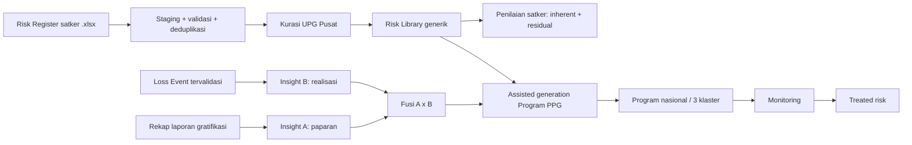

# Starter Kit AI Agent — Risk Sim dan Modul Khusus PPG

**Versi handoff:** 1.0  
**Tanggal snapshot:** 8 September 2026  
**Repository:** `workspacericky-dot/risk-sim`  
**Branch aktif saat snapshot:** `main`  
**HEAD/origin baseline:** `97429c5` — `feat(ppg): add risk register import and bottom-up curation`

## 1. Tujuan Dokumen

Dokumen ini adalah starter kit untuk AI Agent yang akan melanjutkan pembangunan Risk Sim bersama agent lain. Gunakan dokumen ini untuk:

- memahami keadaan aplikasi dan modul PPG saat ini;
- membedakan fitur yang sudah committed dari perubahan lokal yang belum committed;
- menjaga keputusan domain dan keamanan yang sudah disepakati;
- menemukan file sumber utama tanpa memindai seluruh repository;
- menjalankan verifikasi yang sesuai sebelum menyerahkan perubahan;
- mengurangi benturan ketika beberapa agent bekerja paralel.

> Status sumber: `.ua/knowledge-graph.json` belum tersedia ketika dokumen ini dibuat. Pemetaan berikut disusun langsung dari Git history, working tree, source code, migrasi, dan dokumentasi PPG. Jalankan `/understand` bila knowledge graph diperlukan untuk pemetaan codebase yang lebih luas.

## 2. Snapshot Keadaan Proyek

### 2.1 Kondisi Git

Pada saat snapshot:

- `main` sejajar dengan `origin/main` pada commit `97429c5`;
- repository terhubung ke `https://github.com/workspacericky-dot/risk-sim.git`;
- proyek Vercel lokal bernama `risk-sim`;
- terdapat perubahan PPG penting yang **belum committed, belum push, dan belum dipastikan ter-deploy**.

Jangan berpindah branch, reset, checkout paksa, atau membersihkan working tree sebelum menyelamatkan perubahan berikut:

| Status | File | Isi perubahan |
| --- | --- | --- |
| Modified | `src/app/dashboard/ppg/risk-import-actions.ts` | Perbaikan Server Action dan aksi hapus batch Risk Register. |
| New | `src/app/dashboard/ppg/risk-import-state.ts` | State awal `useActionState` dipisah dari file `'use server'`. |
| Modified | `src/app/dashboard/ppg/RiskRegisterImportForm.tsx` | Tautan dan petunjuk template kosong. |
| Modified | `src/app/dashboard/ppg/RiskCandidateReview.tsx` | Import state dipindahkan ke modul netral. |
| Modified | `src/app/dashboard/ppg/penilaian/ImportedRiskDraftReview.tsx` | Import state dipindahkan ke modul netral. |
| Modified | `src/app/dashboard/ppg/pustaka/page.tsx` | Antrean kurasi collapsed dan tombol hapus pada riwayat. |
| New | `src/app/dashboard/ppg/DeleteRiskRegisterImportButton.tsx` | Konfirmasi dan status penghapusan batch. |
| Deleted | `public/templates/Template_RiskLibrary_Sektor_Publik_Redesign_.xlsx` | Workbook asli berisi data dikeluarkan dari aset publik. |
| New | `public/templates/Template_Risk_Register_PPG_2026_Kosong.xlsx` | Template kosong satu-sheet yang aman diunduh. |
| Modified | `scripts/verify-ppg.ts` | Verifikasi template kosong dan fitur impor terbaru. |
| Modified | `output/Panduan_Pengguna_Risk_Sim_Khusus_PPG_Updated.md` | Panduan pengguna versi 2.1. |
| Modified | `output/Spesifikasi_Teknis_Risk_Sim_Khusus_PPG_Updated.md` | Spesifikasi teknis versi 2.1. |

Selalu mulai dengan:

```powershell
git status -sb
git diff --stat
git diff --check
```

### 2.2 Verifikasi terakhir

Verifikasi terakhir yang berhasil:

- scoped ESLint pada file PPG yang berubah;
- `npm run test:ppg`;
- `npm run build` menggunakan Next.js 16.2.2/Turbopack;
- pemeriksaan struktur workbook: satu sheet `Risk Register 2026`, tidak ada baris risiko sumber, header dan formula tersedia.

Pengujian UI browser otomatis belum dilakukan karena sesi browser dan runtime Python Playwright tidak tersedia pada lingkungan agent saat itu. Uji manual terautentikasi tetap dianjurkan sebelum rilis.

### 2.3 Fitur committed beberapa hari terakhir

| Tanggal | Commit | Hasil utama |
| --- | --- | --- |
| 7 Sep 2026 | `198b242` — `upgrade_v2` | Modul Khusus PPG end-to-end: navigasi, library, penilaian, LED, analitik, program, laporan, migrasi, dan verifikasi. |
| 7 Sep 2026 | `0c040e5` | Logo Risk Sim menjadi favicon/app icon, termasuk ikon 192/512 dan Apple icon. |
| 8 Sep 2026 | `97429c5` | Impor Risk Register 2026, staging, similarity, kurasi bottom-up, dua mode impor, residual/treated risk, dan panduan versi awal. |

Perubahan lokal setelah `97429c5` memperbaiki template publik, kompatibilitas Server Action Next.js 16, penghapusan batch impor, UX antrean kurasi, serta dokumentasi.

### 2.4 Ringkasan pekerjaan dan keputusan beberapa hari terakhir

Bagian ini menjelaskan urutan evolusi fitur agar agent baru memahami alasan di balik bentuk aplikasi saat ini.

#### A. Fondasi Modul Khusus PPG

- Membangun alur terpadu dari Risk/Control Library, Penilaian Risiko Satker, Loss Event Database, analitik, penyusunan Program PPG, monitoring, sampai laporan.
- Memisahkan kewenangan UPG Satker dan UPG Pusat/Admin pada UI, Server Action, dan RLS.
- Menetapkan bahwa satu loss event dan satu item Program PPG harus mengacu pada satu risiko generik utama agar hubungan data dan evaluasi tetap mudah diaudit.
- Menyatukan istilah tingkat risiko menjadi `inherent`, `residual`, dan `treated`. Kolom `*_existing` tetap dipertahankan sebagai nama teknis legacy, tetapi seluruh label bisnis harus menyebutnya residual.

#### B. Loss Event Database dan pengalaman daftar

- Menambahkan kode LED otomatis per tahun, klasifikasi under/upper limit, versi batas dampak, RCA, kegagalan kontrol, lesson learned, bukti privat, dan alur status Satker–Pusat.
- Mengubah daftar loss event menjadi kartu ringkas yang tertutup secara default dan dapat diekspansi untuk melihat isi lengkap.
- Menambahkan pencarian lintas informasi utama, pilihan 5/10/50/100 item per halaman, serta navigasi halaman sebelumnya/berikutnya.
- Memastikan link bukti dibuat sebagai signed URL berumur terbatas dan tidak menjadikan bucket publik.

#### C. Analitik otomatis dan assisted generation

- Mengubah Insight A dan Insight B dari isian manual menjadi bahan analitik read-only yang dihitung mesin, lalu dibekukan dalam snapshot ketika draf program disimpan.
- Insight A mengukur **paparan** dari laporan gratifikasi melalui konsentrasi skenario, anomali periode rawan, konsentrasi jabatan, objek berisiko tinggi, dan pertumbuhan terhadap baseline.
- Insight B mengukur **realisasi risiko** dari loss event tervalidasi melalui persentase satker terdampak, satker dengan dampak tinggi, kejadian berulang, dan kegagalan kontrol.
- Menambahkan narasi, progress bar, kartu metrik, komponen pembentuk skor, dan keterangan interpretasi agar angka seperti `82/100` dapat ditelusuri, bukan sekadar label tinggi/sedang/normal.
- Mengganti konstanta rekomendasi yang semula bersifat kategorikal dengan skor komposit yang dapat dijelaskan: komponen dinormalisasi, dikalikan bobot, lalu dijumlahkan menjadi skor Insight A atau Insight B.
- Menetapkan mesin hanya membantu menghasilkan rekomendasi, indikator, target, dan klaster; keputusan akhir dan pengesahan tetap dilakukan UPG Pusat.
- Mendukung perbandingan dua model cakupan: program nasional untuk seluruh satker atau program nasional dengan tiga klaster tematik berbasis urgensi.

#### D. Laporan dan dokumentasi

- Menambahkan laporan perencanaan dan pelaksanaan Program PPG dalam tampilan siap-cetak sehingga pengguna dapat menyimpan PDF melalui browser, serta ekspor XLSX untuk pengolahan lanjutan.
- Menyusun panduan pengguna dan spesifikasi teknis awal dalam PDF, kemudian memperbaruinya sebagai Markdown di folder `output/` agar mudah dipelihara bersama source code.
- Menjelaskan rumus Insight A/B, fusi skor, sumber data, pembobotan, interpretasi, keterbatasan, dan kebutuhan kalibrasi berkala pada spesifikasi teknis.

#### E. Identitas deployment

- Menjadikan `public/risk-sim-logo.png` sebagai sumber app icon/favicon Risk Sim, termasuk varian 192×192, 512×512, dan Apple icon untuk tampilan deployment/PWA yang konsisten.

#### F. Bootstrap Risk Library secara bottom-up

- Menganalisis workbook referensi `Risk Register 2026` untuk memperoleh kontrak kolom, bukan untuk dipublikasikan sebagai template pengguna.
- Menambahkan dua mode impor: `bootstrap_library` untuk menyusun kandidat generik ketika library masih kosong dan `operasional_assessment` untuk membuat draf penilaian satker.
- Menambahkan staging berjejak, validasi baris, normalisasi teks, similarity matching, pengelompokan kandidat, confidence, dan antrean persetujuan UPG Pusat/Admin.
- Menambahkan autofill nilai yang tersedia dari workbook; kolom yang tidak dapat diekstrak sengaja dibiarkan kosong untuk dilengkapi manual.
- Membuat template unduhan kosong yang hanya memuat sheet `Risk Register 2026`, header baku, petunjuk, dan formula—tanpa membawa data asli dari workbook referensi.
- Memperbaiki runtime error Next.js `A "use server" file can only export async functions` dengan memindahkan object initial state ke `risk-import-state.ts`.
- Menambahkan penghapusan riwayat impor untuk UPG Pusat/Admin. Penghapusan batch membersihkan staging dan relasi kandidat melalui cascade, tetapi tidak menghapus Risk Library atau register yang sudah diterbitkan.
- Mengubah Antrean Kurasi dan Riwayat Impor menjadi bagian yang ringkas/collapsed secara default agar halaman pustaka tidak dipenuhi seluruh isi sekaligus.

Urutan mental yang perlu dipertahankan oleh agent berikutnya:

```text
Workbook sumber → staging/validasi → pencocokan dan kandidat → keputusan manusia
→ Risk Library generik → penilaian Satker → LED tervalidasi → Insight A/B
→ assisted generation → Program PPG → monitoring → treated risk
```

## 3. Teknologi dan Konvensi Wajib

| Lapisan | Teknologi/aturan |
| --- | --- |
| Framework | Next.js `16.2.2`, App Router, Turbopack. |
| UI | React `19.2.4`, Tailwind CSS 4, Lucide React. |
| Database/Auth/Storage | Supabase/PostgreSQL, RLS, Auth, private storage. |
| Analitik visual | Recharts 3.8.1. |
| Excel input | SheetJS `xlsx` 0.20.3. |
| Excel output | ExcelJS 4.4.0. |
| Bahasa | TypeScript. |
| Hosting | Vercel project `risk-sim`; Git remote `origin`. |

Aturan repository di `AGENTS.md` bersifat wajib: ini bukan versi Next.js yang boleh diasumsikan dari pengetahuan lama. Sebelum mengubah API/convention Next.js, baca panduan relevan di `node_modules/next/dist/docs/`.

Khusus Server Actions:

- file dengan directive top-level `'use server'` hanya boleh mengekspor fungsi `async`;
- jangan mengekspor object, constant runtime, class, atau fungsi sinkron dari file tersebut;
- tipe dan state awal formulir diletakkan pada modul netral seperti `risk-import-state.ts`;
- autentikasi dan otorisasi harus diperiksa kembali di setiap action, meskipun tombol sudah disembunyikan di UI.

Environment yang digunakan source code:

```text
NEXT_PUBLIC_SUPABASE_URL
NEXT_PUBLIC_SUPABASE_ANON_KEY
SUPABASE_SERVICE_ROLE_KEY
```

Jangan menampilkan, mencatat, atau commit nilai environment. `.env*`, `.vercel`, dan `ref/` di-ignore.

## 4. Gambaran Arsitektur PPG



Prinsip domain yang tidak boleh diubah tanpa persetujuan pemilik produk:

1. Risk Library berisi risiko **generik**, bukan risiko milik satker.
2. Kepemilikan satker berada pada `ppg_register` dan `ppg_loss_events`.
3. Impor tidak boleh langsung menerbitkan kandidat menjadi Risk Library aktif.
4. Mesin mengusulkan; keputusan final tetap pada UPG Pusat/Admin.
5. Satu Program PPG selalu berfokus pada satu risiko generik utama.
6. Insight A adalah indeks paparan dari laporan gratifikasi; Insight B adalah indeks realisasi dari loss event tervalidasi.
7. Insight B memakai persentase satker, bukan jumlah event mentah, agar satu satker tidak mendominasi.
8. Program dapat berlaku nasional atau nasional dengan tiga klaster tematik.
9. Istilah bisnis: **inherent risk → residual risk → treated risk**.
10. Kolom database `*_existing` adalah nama legacy yang makna bisnisnya residual; jangan rename sembarangan.
11. Loss event harus memiliki satu `risk_library_id` utama.
12. Nama, NIK, dan identitas pemberi gratifikasi tidak disimpan pada `ppg_reports`.

## 5. Peran dan Hak Akses

| Peran | Hak utama |
| --- | --- |
| `upg_satker` | Membaca library aktif, mengelola penilaian dan kontrol aktual unitnya, mencatat/mengajukan loss event unitnya, mengisi treated risk setelah program. |
| `upg_pusat` | Mengelola library/kandidat, membaca penilaian seluruh satker, memvalidasi LED, menjalankan analitik, menetapkan program, serta menghapus batch impor Risk Register. |
| `admin_sistem` | Hak lintas unit untuk koreksi, administrasi, kurasi, validasi, dan penghapusan batch. |

Sumber kebenaran akses:

- `src/lib/ppg/access.ts` untuk pemeriksaan aplikasi;
- `public.ppg_is_pusat()`, `public.ppg_is_satker()`, dan `public.ppg_user_unit_id()` dalam migrasi;
- policy RLS dalam `supabase/migration_ppg.sql`.

UI bukan batas keamanan. Gunakan profil autentikasi, ownership unit, dan RLS pada server.

## 6. Route dan File Map

### 6.1 Route pengguna

| Route | Fungsi | Akses utama |
| --- | --- | --- |
| `/dashboard/ppg` | Ringkasan dan pintasan alur kerja. | Pusat/Admin. |
| `/dashboard/ppg/pustaka` | Risk/Control Library, impor bootstrap, kurasi, riwayat batch. | Pusat/Admin. |
| `/dashboard/ppg/penilaian` | Impor operasional, register, matriks 5×5, kontrol, treated risk. | Satker/Admin; pusat read-only. |
| `/dashboard/ppg/loss-event` | Pencatatan dan validasi Loss Event Database. | Satker/Pusat/Admin sesuai status. |
| `/dashboard/ppg/analitik` | Insight A/B, visual, ranking, rekomendasi. | Pusat/Admin. |
| `/dashboard/ppg/tindak-lanjut` | Assisted generation dan monitoring Program PPG. | Pusat/Admin. |
| `/dashboard/ppg/referensi` | Matriks serta impor laporan gratifikasi anonim. | Pusat/Admin. |

`PpgModuleNav.tsx` menyembunyikan semua menu selain Penilaian Risiko dan Loss Event untuk UPG Satker.

### 6.2 File domain utama

| File | Tanggung jawab |
| --- | --- |
| `src/lib/ppg/access.ts` | Auth, role, unit, dan guard pusat/satker. |
| `src/lib/ppg/data.ts` | Read model dan agregasi query Supabase. |
| `src/lib/ppg/scoring.ts` | Skor K×D dan level risiko khusus PPG. |
| `src/lib/ppg/references.ts` | Daftar kategori, klasifikasi, proses, faktor, periode, dampak. |
| `src/lib/ppg/import-workbook.ts` | Parser laporan gratifikasi dengan sanitasi PII. |
| `src/lib/ppg/risk-register-workbook.ts` | Parser Risk Register 2026, normalisasi, signature, similarity. |
| `src/lib/ppg/analytics.ts` | Analisis tren, objek, musim, asosiasi, kualitas, rekomendasi. |
| `src/lib/ppg/insights.ts` | Insight A, fusi A/B, baseline, KRI, klaster, assisted insight. |
| `src/lib/ppg/led.ts` | Matching kandidat laporan gratifikasi dengan loss event. |
| `src/app/dashboard/ppg/actions.ts` | Command utama PPG di luar pipeline Risk Register. |
| `src/app/dashboard/ppg/risk-import-actions.ts` | Import, kurasi, pembuatan register, penghapusan batch. |
| `supabase/migration_ppg.sql` | Skema, constraint, index, trigger, RLS, seed, bucket. |
| `scripts/verify-ppg.ts` | Regression checks domain, parser, template, insight, dan migrasi. |

### 6.3 Dokumentasi sumber kebenaran

- `output/Panduan_Pengguna_Risk_Sim_Khusus_PPG_Updated.md` — panduan pengguna v2.1.
- `output/Spesifikasi_Teknis_Risk_Sim_Khusus_PPG_Updated.md` — spesifikasi teknis v2.1.
- `PPG/PLAN-KHUSUS-PPG.md` — dokumen rencana awal/historis; beberapa keputusan akses di dalamnya sudah berubah.
- `ref/PPG/KRI.md`, `ref/PPG/LED.md`, dan workbook referensi — bahan lokal yang di-ignore Git; jangan mengasumsikannya tersedia pada clone baru.

## 7. Kontrak Risk Register 2026

Template publik yang benar:

```text
public/templates/Template_Risk_Register_PPG_2026_Kosong.xlsx
```

Kontrak parser:

- format `.xlsx`, maksimum 10 MB;
- tepat menggunakan sheet `Risk Register 2026`;
- `A1` mengandung `risk register`;
- `C4` mengandung `potensi`;
- Triwulan berada di `E2`, Tahun di `G2`;
- data dimulai pada baris 6;
- satu baris mewakili satu risiko.

| Kolom | Arti |
| --- | --- |
| B | Unit kerja; parser melakukan fill-down. |
| C | Potensi/peristiwa risiko; baris tanpa nilai dilewati. |
| D | Klasifikasi risiko. |
| E/F | Probabilitas inherent dan keterangannya. |
| G/H | Dampak inherent dan uraian dampak. |
| J/K | Faktor serta uraian penyebab. |
| N | Kontrol sumber. |
| P | Rencana mitigasi sumber. |

Residual dan treated risk sengaja tidak direka dari template. Nilainya dilengkapi di aplikasi.

Similarity kandidat menggunakan bobot:

```text
70% peristiwa + 10% penyebab + 5% dampak
+ 10% exact klasifikasi + 5% exact faktor penyebab
```

- skor ≥88 terhadap library: dipetakan sebagai kandidat cocok library;
- skor ≥72 terhadap kandidat terbuka: digabung sebagai anggota kandidat;
- selain itu: kandidat baru;
- nama aktivitas identik sebelum `–`, `—`, atau `:` dapat menaikkan skor minimum menjadi 92;
- seluruh hasil tetap memerlukan human review.

### 7.1 Keamanan template

Jangan pernah menyalin workbook sumber yang berisi data ke `public/`. Aset pada `public/` dapat diakses tanpa autentikasi. Template unduhan harus:

- hanya memiliki satu sheet;
- tidak memiliki satu pun data risiko/satker;
- berisi header, petunjuk, validasi, dan baris kosong;
- diverifikasi dalam `scripts/verify-ppg.ts`.

## 8. Penghapusan Riwayat Impor

`deletePpgRiskImport` hanya untuk UPG Pusat/Admin dan harus mempertahankan batas berikut:

- hapus `ppg_risk_import_batches` target;
- cascade menghapus `ppg_risk_import_rows` dan membership sumber;
- hapus kandidat `usulan`/`review` hanya bila tidak mempunyai sumber batch lain;
- jangan hapus Risk Library yang sudah disetujui;
- jangan hapus register/mitigasi yang sudah dibuat;
- tulis metadata penghapusan ke `ppg_audit_log`;
- revalidate halaman pustaka, penilaian, dan referensi;
- setelah batch terhapus, hash file yang sama boleh diimpor kembali.

UI menggunakan dialog `window.confirm`. Antrean kurasi dan riwayat impor menggunakan `<details>` tanpa `open`, sehingga tertutup saat render awal.

## 9. Model Data Penting

Kelompok tabel utama:

| Domain | Tabel |
| --- | --- |
| Library | `ppg_risk_library`, `ppg_control_library`, `ppg_library_risk_controls` |
| Penilaian | `ppg_register`, `ppg_risk_controls`, `ppg_risk_control_validations`, `ppg_mitigations` |
| Laporan | `ppg_import_batches`, `ppg_reports`, `ppg_classification_rules` |
| Bootstrap/kurasi | `ppg_risk_import_batches`, `ppg_risk_import_rows`, `ppg_risk_candidates`, `ppg_risk_candidate_members` |
| Analitik/program | `ppg_analysis_snapshots`, `ppg_action_catalog`, `ppg_programs`, `ppg_program_items`, `ppg_program_clusters`, `ppg_program_cluster_units`, `ppg_program_updates`, `ppg_program_item_controls` |
| LED | `ppg_led_limit_versions`, `ppg_loss_events`, `ppg_loss_event_code_counters`, `ppg_loss_event_report_links`, `ppg_program_loss_events` |
| Audit | `ppg_audit_log` |

Skor PPG:

| Skor | Level |
| --- | --- |
| 1–5 | Sangat Rendah |
| 6–11 | Rendah |
| 12–15 | Sedang |
| 16–19 | Tinggi |
| 20–25 | Sangat Tinggi |

Jangan menggunakan matriks risiko umum atau SMAP untuk menghitung level PPG.

## 10. Status Kapabilitas

| Kapabilitas | Status | Catatan |
| --- | --- | --- |
| Navigasi dan role PPG | Implemented | Satker hanya melihat Penilaian dan Loss Event. |
| Risk/Control Library | Implemented | Relasi generik M:N dan lifecycle aktif/nonaktif. |
| Penilaian inherent/residual | Implemented | `*_existing` bermakna residual. |
| Treated risk | Implemented | Diisi pasca-Program PPG. |
| Loss Event + bukti privat | Implemented | Kode LED otomatis dan validasi pusat. |
| Impor laporan gratifikasi anonim | Implemented | Rekap KPK dan format GOL lama didukung. |
| Insight A/B + visual | Implemented | Assisted insight, bukan keputusan otomatis. |
| Program nasional/berklaster | Implemented | Tiga klaster dan snapshot analitik. |
| Impor Risk Register bottom-up | Implemented | Dua mode, staging, similarity, kurasi. |
| Template kosong aman | Implemented locally | Belum committed pada snapshot. |
| Hapus batch Risk Register | Implemented locally | Belum committed; pusat/admin saja. |
| Panel kurasi collapsed | Implemented locally | Belum committed; native `<details>`. |
| Browser E2E terautentikasi | Outstanding | Lakukan sebelum production release bila environment tersedia. |
| Knowledge graph `.ua` | Not generated | Jalankan `/understand` bila dibutuhkan. |

## 11. Hotspot dan Risiko Regresi

Area yang harus disentuh dengan hati-hati:

1. `supabase/migration_ppg.sql` — satu file besar, idempotent, memuat upgrade instalasi lama, RLS, trigger, dan seed.
2. `src/app/dashboard/ppg/actions.ts` — banyak command domain; perubahan kecil dapat memengaruhi beberapa submenu.
3. `src/lib/ppg/data.ts` — query relasi Supabase kompleks; alias FK penting agar PostgREST tidak ambigu.
4. `src/lib/ppg/analytics.ts` dan `insights.ts` — rumus harus dapat dijelaskan, dibatasi 0–100, dan tidak memakai angka kategori arbitrer.
5. `risk-import-actions.ts` — orkestrasi multi-tabel memakai admin client setelah otorisasi eksplisit.
6. File `'use server'` — runtime export non-async akan menggagalkan module evaluation Next.js.
7. Static workbook di `public/` — kebocoran data terjadi bila file sumber tersalin ke sini.
8. Penghapusan batch — kandidat multisumber dan data resmi harus tetap selamat.

## 12. Checklist Memulai Pekerjaan

1. Baca `AGENTS.md`.
2. Jalankan `git status -sb`; jangan anggap working tree bersih.
3. Baca diff file yang akan disentuh sebelum mengedit.
4. Baca panduan Next.js 16 yang relevan di `node_modules/next/dist/docs/`.
5. Baca dua dokumen PPG versi 2.1 di `output/`.
6. Untuk perubahan skema, telusuri urutan create/alter/policy dalam `migration_ppg.sql`.
7. Untuk perubahan perhitungan, tambahkan contoh hitung dan regression check.
8. Untuk perubahan role, periksa guard aplikasi **dan** RLS.
9. Untuk file impor, uji format valid, sheet salah, file kosong, duplikat hash, dan data parsial.
10. Hindari perubahan lintas modul Risk Sim jika tidak diperlukan oleh scope.

## 13. Checklist Verifikasi dan Rilis

Verifikasi minimum:

```powershell
npm run test:ppg
npm run lint
npm run build
git diff --check
git status -sb
```

Untuk perubahan UI, uji manual terautentikasi minimal sebagai:

- UPG Satker;
- UPG Pusat;
- Admin Sistem.

Skenario PPG yang perlu diperiksa:

1. unduh template dan pastikan hanya satu sheet tanpa data;
2. unggah pada mode bootstrap dan operasional;
3. pastikan antrean kurasi tertutup saat awal;
4. buka kandidat dan bukti sumber;
5. hapus batch duplikat dan pastikan kandidat multisumber tetap ada;
6. impor ulang file yang hash-nya sebelumnya dihapus;
7. pastikan Risk Library/register yang sudah terbit tidak ikut terhapus;
8. pastikan user satker tidak memperoleh aksi pusat.

Sebelum push/deploy:

- pastikan migration yang dibutuhkan sudah diterapkan pada Supabase target;
- jangan commit `.env.local`, `.vercel`, `ref/`, data pribadi, atau workbook sumber;
- review staged diff, terutama binary dan migrasi;
- gunakan commit message yang menjelaskan domain, misalnya `feat(ppg): secure risk register import lifecycle`;
- push/deploy hanya setelah diminta atau disetujui pemilik proyek;
- verifikasi URL production dan log deployment setelah rilis.

## 14. Protokol Kolaborasi Multi-Agent

Sebelum bekerja, setiap agent menyatakan scope dan file ownership. Hindari dua agent mengedit file hotspot yang sama secara bersamaan.

Pembagian yang relatif aman:

| Workstream | File utama |
| --- | --- |
| UI/UX PPG | `src/app/dashboard/ppg/**` selain action besar. |
| Domain/analitik | `src/lib/ppg/**`. |
| Database/security | `supabase/migration_ppg.sql`, `access.ts`, policy review. |
| QA/documentation | `scripts/verify-ppg.ts`, `output/*.md`. |

Aturan koordinasi:

- umumkan perubahan kontrak data sebelum mengedit consumer;
- jangan melakukan formatting massal pada file yang sedang diedit agent lain;
- pertahankan perubahan user dan agent lain yang sudah ada;
- buat commit kecil dan koheren setelah working tree awal sudah diamankan;
- bila mengubah skema, sertakan perubahan query, action, test, dan dokumentasi dalam satu handoff;
- bila menemukan keputusan domain ambigu, berhenti sebelum membuat nilai/rule baru secara arbitrer.

Format handoff antar-agent:

```text
Tujuan:
File yang diubah:
Keputusan/asumsi:
Perilaku sebelum → sesudah:
Test yang dijalankan:
Hal yang belum diverifikasi:
Risiko/next step:
```

## 15. Backlog Lanjutan yang Disarankan

Urutan berikut paling bernilai setelah patch lokal diamankan:

1. commit dan deploy paket perubahan template + Server Action + delete batch + collapsed queue;
2. jalankan smoke test production untuk download/upload template;
3. uji penghapusan batch dengan kandidat yang hanya satu sumber dan kandidat multisumber;
4. tambahkan pagination/search pada antrean kurasi bila volume kandidat meningkat;
5. tambahkan integration test Supabase/RLS untuk tiga role;
6. buat migration terpisah berikutnya bila diperlukan—jangan menumpuk perubahan destruktif tanpa strategi rollback;
7. generate knowledge graph `/understand` dan perbarui starter kit bila arsitektur lintas modul ikut berubah.

## 16. Definition of Done untuk Agent Berikutnya

Pekerjaan dianggap selesai bila:

- kebutuhan pengguna benar-benar tercermin di UI dan server;
- aturan role/ownership divalidasi di server serta konsisten dengan RLS;
- tidak ada data sensitif baru yang masuk aset publik, log, atau analytics DTO;
- migrasi bersifat aman/idempotent untuk instalasi lama bila skema berubah;
- test terkait ditambah atau diperbarui;
- `npm run test:ppg`, lint relevan, build, dan `git diff --check` lulus;
- dokumentasi diperbarui bila perilaku pengguna atau kontrak teknis berubah;
- status commit, push, migration, dan deployment dilaporkan secara eksplisit;
- hal yang belum diuji tidak disamarkan sebagai selesai.

## 17. Update: Control Effectiveness Index & Bottom-Up Curation (9 Sep 2026)

Pada iterasi ini, ditambahkan mekanisme kurasi dan evaluasi *Control Library* yang ditarik dari hasil *self-assessment* dan *Loss Event* aktual (CEI - Control Effectiveness Index).

### 17.1 Konsep & Rumus Control Effectiveness Index (CEI)
- **Base Score**: Dihitung dari `ppg_risk_controls.efektivitas`. (Efektif = 1, Sebagian = 0.5, Tidak = 0, Belum = ignored). Skor dirata-rata ke dalam persentase 0-100.
- **Penalty**: Dikurangi 5 poin untuk setiap insiden aktual (`ppg_loss_events`) berstatus `tervalidasi`, `tindak_lanjut`, atau `ditutup` yang terkait dengan `register_id` tempat kontrol digunakan, karena hal tersebut mengindikasikan kegagalan kontrol di lapangan.
- **Batasan**: CEI dibatasi agar tidak turun di bawah 0. Kontrol yang memiliki indeks `< 50` akan mendapat tanda merah (*destructive badge*) pada UI. Kontrol yang seluruh penilaiannya masih `belum_dinilai` ditampilkan sebagai **Belum dinilai**, bukan diberi CEI 0.

### 17.2 Penambahan Komponen Baru
| File | Fungsi |
| --- | --- |
| `src/lib/ppg/data.ts` | Penambahan `getPpgControlEffectiveness()` (agregasi relasi `ppg_control_library`, `ppg_risk_controls`, `ppg_loss_events`) dan `getPpgEmergingControls()` (ekstraksi pengelompokan `ppg_mitigations.tindakan` berstatus selesai; popularitas dihitung berdasarkan Satker unik dan kandidat yang sudah dipromosikan disisihkan). |
| `src/lib/ppg/control-effectiveness.ts` | Fungsi murni perhitungan CEI dan normalisasi teks kontrol agar rumus dapat diuji tanpa akses database. |
| `src/app/dashboard/ppg/control-actions.ts` | *Server Action* murni baru untuk mendeaktivasi kontrol (`deactivateControlLibrary`) dan membuat kontrol generik dari mitigasi (`promoteMitigationToControl`). |
| `src/app/dashboard/ppg/pustaka/ControlEffectivenessPanel.tsx` | UI tabel UPG Pusat untuk melihat daftar CEI beserta tombol *Nonaktifkan*. |
| `src/app/dashboard/ppg/pustaka/EmergingControlsPanel.tsx` | UI tabel untuk menampilkan mitigasi lokal terpopuler dengan tombol *Promote*. |

### 17.3 Siklus Hidup Pustaka Kontrol (Lifecycle)
Sesuai prinsip PPG (mesin hanya mengusulkan, manusia memutuskan):
1. **Pensiun (Retire)**: Kontrol dengan CEI rendah dapat dinonaktifkan (diubah menjadi `nonaktif` pada `ppg_control_library`). Kontrol tersebut disembunyikan dari pilihan *dropdown* satker ke depannya, namun data historis satker tetap utuh (tidak terkena imbas `CASCADE`).
2. **Promosi (Promote)**: Rencana mitigasi satker yang unik dan selesai dilaksanakan dapat diangkat menjadi kontrol generik. Sistem akan membuat entri baru dengan kode urut otomatis mengikuti konvensi pustaka (`PPG.K.[nomor]`), menetapkan `uraian` awal, lalu menautkannya otomatis ke tabel relasi `ppg_library_risk_controls`. Aksi promosi dan penonaktifan dicatat di `ppg_audit_log`.

### 17.4 Penyempurnaan alur evaluasi dan evidence

- Validasi bukti efektivitas kontrol kini mengembalikan pesan sukses/gagal pada setiap baris. Status `disetujui` tetap mensyaratkan tautan bukti dari Satker.
- Form treated risk dipindahkan dari Penilaian Risiko ke Program PPG. UPG Satker memperoleh akses ke submenu Program PPG untuk menilai program yang item risikonya telah selesai, memilih efektivitas program, dan menyertakan tautan evidence.
- Hasil terbaru disimpan pada `ppg_register` melalui `treated_program_id`, `efektivitas_program`, `bukti_efektivitas_program_url`, `treated_assessed_by`, dan `treated_assessed_at`.
- Draf hasil impor pada Penilaian Risiko tertutup secara default dan dapat dibuka bila diperlukan.
- Loss Event dapat mereferensikan satu atau beberapa kontrol aktual dari Risk Register melalui `ppg_loss_event_controls`; kolom teks `kegagalan_kontrol` tetap dipertahankan sebagai keterangan tambahan.
- Untuk Loss Event baru yang memiliki referensi kontrol, penalti CEI hanya dikenakan pada kontrol yang dipilih. Data historis tanpa referensi terstruktur tetap memakai fallback register agar riwayat lama tidak hilang.
- Kriteria sementara CEI: `0–49` rendah/merah, `50–79` kurang efektif/kuning, dan `80–100` tinggi/hijau. Penonaktifan selalu memerlukan keputusan manusia.

---

**Prompt pembuka yang disarankan untuk AI Agent baru:**

> Baca `AGENTS.md`, `output/STARTER_KIT_AI_AGENT_RISK_SIM_PPG.md`, kedua panduan PPG versi terbaru, lalu periksa `git status -sb` dan diff sebelum bertindak. Pertahankan working tree yang ada. Untuk perubahan Next.js, baca dokumentasi versi lokal di `node_modules/next/dist/docs/`. Jelaskan scope, file ownership, dan test yang akan dijalankan sebelum mulai mengedit.
