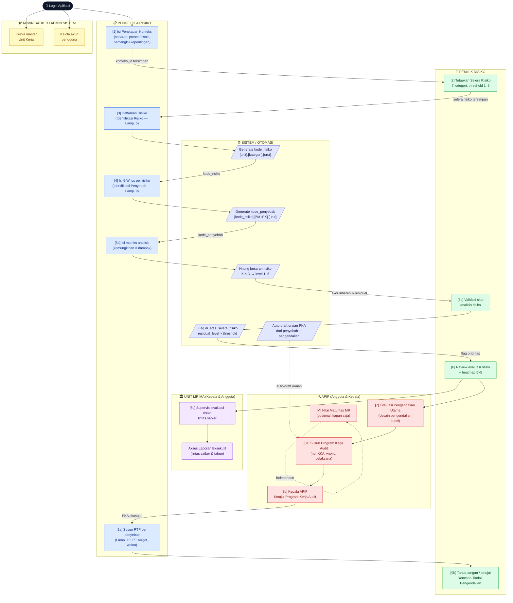
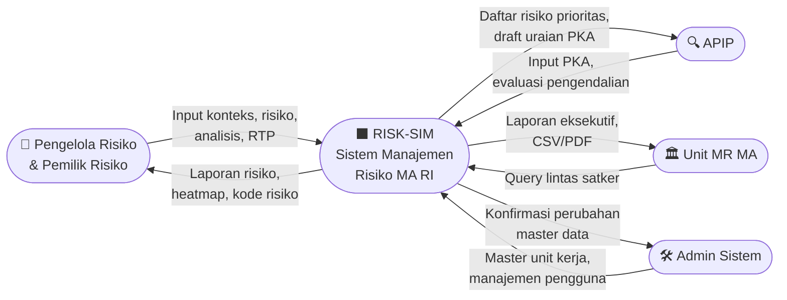
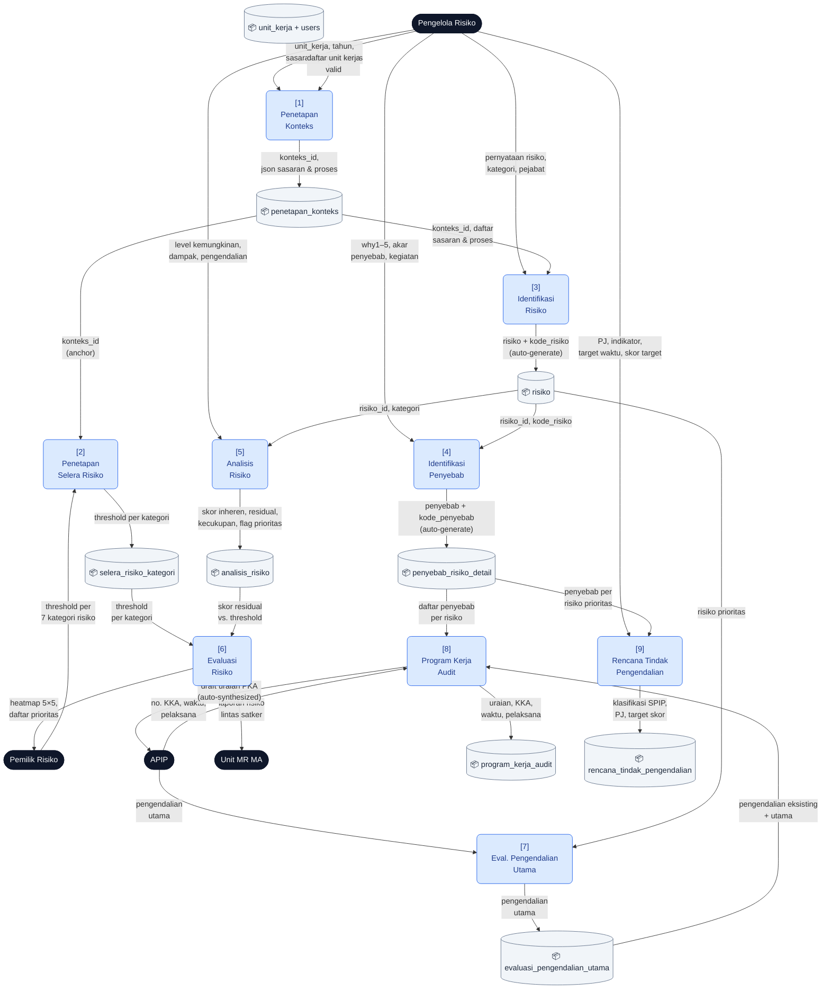
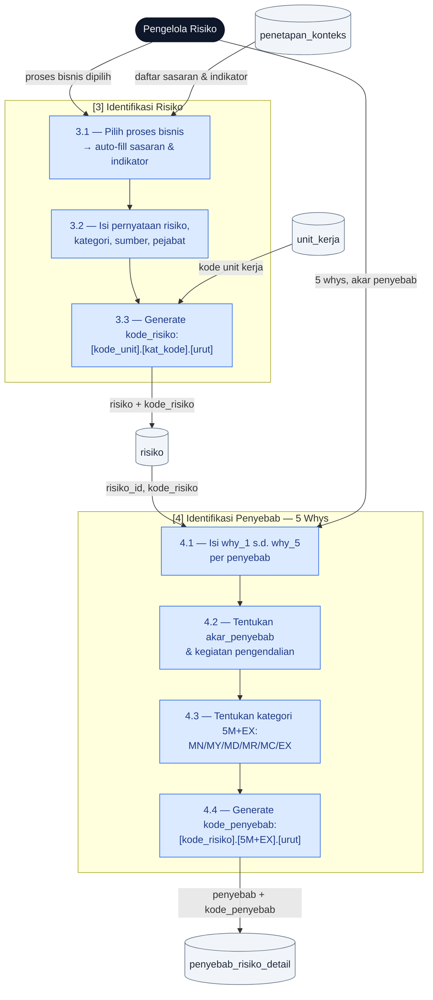
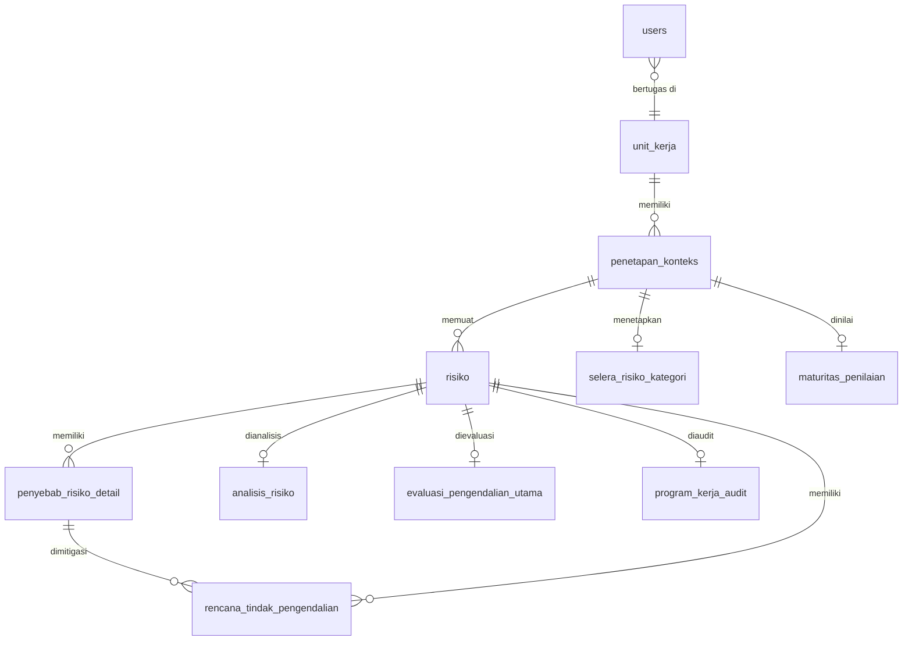

# Diagram Proses — Aplikasi Risk-Sim MA

> Format: Mermaid. Render di VS Code (ekstensi *Mermaid Preview*), GitHub, atau [mermaid.live](https://mermaid.live).

---

## 1. Swimlane Diagram — Alur Proses per Peran

Menggambarkan **siapa melakukan apa** dalam siklus manajemen risiko, dikelompokkan per peran (lane).

### Legenda Warna

| Warna | Peran |
|-------|-------|
| 🟣 Ungu muda | Sistem / Otomasi |
| 🟡 Kuning | Admin Satker / Admin Sistem |
| 🟢 Hijau | Pemilik Risiko |
| 🔵 Biru | Pengelola Risiko |
| 💜 Ungu tua | Unit MR MA |
| 🔴 Merah | APIP |

---

## 2. Dataflow Diagram (DFD) — Aliran Data Antar Proses

### Level 0 — Context Diagram

Gambaran paling tinggi: sistem Risk-Sim sebagai satu proses tunggal dengan aktor eksternal.

---

### Level 1 — DFD Proses Utama

Menampilkan 9 proses inti beserta data store (tabel database) dan aliran data antar proses.

---

### Level 2 — DFD Detail: Proses Analisis & Evaluasi Risiko

Zoom-in pada proses [5] dan [6] yang paling kritis secara kalkulasi.

```mermaid
flowchart LR
    %% Aktor
    PG(["Pengelola Risiko"])
    PR(["Pemilik Risiko"])

    %% Data stores input
    DS_R[("risiko")]
    DS_S[("selera_risiko_kategori")]

    %% Sub-proses Analisis
    subgraph P5 ["[5] Analisis Risiko"]
        direction TB
        P5a["5.1 — Terima input\nkemungkinan & dampak"]
        P5b["5.2 — Hitung besaran inheren\nK × D (1–25)"]
        P5c["5.3 — Tentukan level inheren\n(1=SR, 2=R, 3=S, 4=T, 5=ST)"]
        P5d["5.4 — Ada pengendalian?\n→ hitung residual"]
        P5e["5.5 — Nilai kecukupan\npengendalian (4 pilihan)"]
        P5a --> P5b --> P5c --> P5d --> P5e
    end

    %% Data store output analisis
    DS_A[("analisis_risiko")]

    %% Sub-proses Evaluasi
    subgraph P6 ["[6] Evaluasi Risiko"]
        direction TB
        P6a["6.1 — Ambil semua analisis\nper konteks_id"]
        P6b["6.2 — Bandingkan\nresidual_level vs. threshold\nper kategori"]
        P6c["6.3 — Flag\ndi_atas_selera_risiko = true/false"]
        P6d["6.4 — Render heatmap 5×5\n& tabel prioritas"]
        P6a --> P6b --> P6c --> P6d
    end

    %% Flow
    PG -->|"K, D, pengendalian"| P5a
    DS_R -->|"risiko_id, kategori"| P5a
    P5e -->|"skor inheren, residual,\nkecukupan, flag"| DS_A
    DS_A -->|"semua analisis"| P6a
    DS_S -->|"threshold per kategori"| P6b
    P6d -->|"heatmap + list prioritas"| PR

    classDef process fill:#dbeafe,stroke:#2563eb,color:#1e3a8a
    classDef store   fill:#f1f5f9,stroke:#64748b,color:#1e293b
    classDef actor   fill:#0f172a,stroke:#0f172a,color:#f8fafc

    class P5a,P5b,P5c,P5d,P5e,P6a,P6b,P6c,P6d process
    class DS_R,DS_S,DS_A store
    class PG,PR actor
```

---

### Level 2 — DFD Detail: Proses Identifikasi & Kode Otomatis

Zoom-in pada proses [3] dan [4] beserta mekanisme auto-generate kode.

---

## 3. Ringkasan Relasi Data Store

---

*Diagram ini menggambarkan state aplikasi Risk-Sim per April 2026. Render menggunakan Mermaid v10+.*